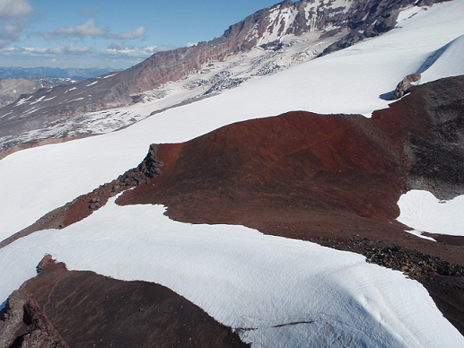
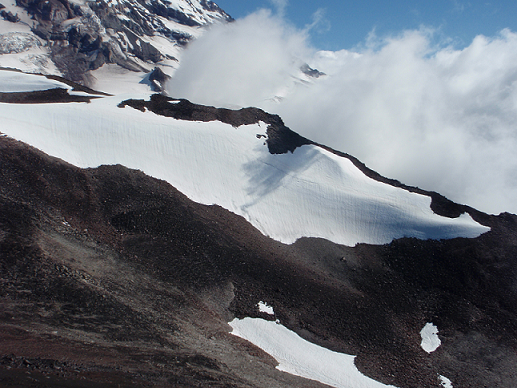

# 袁嘉宏(Jimmy Yuan) <span style="color:red">103011228</span>

# Project 2 / Panorama Stitching

## Overview
The project is related to create a panorama stitching image based on multiple images. In order to create the final result, first of all, we captured the SIFT points and the corresponding descriptor by using vlfeat, trying to match the descriptor of different images based on the Euclidean distance. Then we are going to figure out the affine transformation matrix of these two images. Instead of feeding all our SIFT keypoints to the transformation module, we first use RANSAC(RANdom SAmple Consensus) to select the inliers. Last, we use the inliers to calculate the affine transformation matrix, stitiching the multiple image to reach the final result.

## Implementation
### 1. Get SIFT points and descriptors
* Prerequired packages: [Anaconda python 3.6](https://www.anaconda.com/download/#macos)
* Install [cyvlfeat](https://github.com/menpo/cyvlfeat) for fetching sift features: `conda install -c menpo cyvlfeat` 

### 2. Matching SIFT Descriptors
> In this section, we are going to use `SIFTSimpleMatcher.py` to get the reasonable match points of two different images. First, I use `np.tile()` function to construct an array by repeating each descriptor of image1, the size of array is same as the number of descriptors of image2. To measure the similarity of two descriptors, I calculate Euclidean distance of them, finding the matched descriptor satisfying the threshold, which is really depends on input images. If the smallest distance is less than thresh*(the 2nd smallest distance), we say the two vectors are matched. We can evaluate our function by using `EvaluateSIFTMatcher.py`.

```python3
descriptor1_aug = np.tile(descriptor1[i], (N2, 1))

error = descriptor1_aug - descriptor2
L2_norm = np.sqrt(np.sum(error*error, axis=1))
idx = np.argsort(L2_norm)

if L2_norm[idx[0]] < THRESH*L2_norm[idx[1]]:
    match.append([i, idx[0]])
```

### 3. Fitting the Transformation Matrix
> After obtaining the matched descriptor and corresponding keypoints of images, we can calculate the affine transforamtion matrix of two images. The equation looks like Image2 = Transformation Matirx * Image1. Here we are going to use `ComputeAffineMatrix.py`. Before starting, since this process requires an additional row with number 1 in the bottom of matrix, I use `np.concatenate()` first.

```python3
P1 = np.concatenate([Pt1.T, np.ones([1,N])], axis=0)
P2 = np.concatenate([Pt2.T, np.ones([1,N])], axis=0)
```

> The original eqution looks like Image2 = Transformation Matirx * Image1. However, `np.linalg.lstsq()` can only solve Ax = b, returning x = b/A. Therefore, I calculate the transpose matrix of corresponding images seperately, and then use `np.linalg.lstsq()` , which can return the least-squares solution to a linear matrix equationto. Similarly, we can use `EvaluateAffineMatrix.py` to test the aboved function.

```python3
P1_T = np.transpose(P1)
P2_T = np.transpose(P2)

H_T = np.linalg.lstsq(P1_T, P2_T)[0]
H = np.transpose(H_T)
```

### 4. RANSAC
> RANSAC(RANdom SAmple Consensus) is well-known method to select the inliers. Here we are about to use `RANSACFit.py`. The followings are the step of RANSAC:
> 1. Randomly sample the number of keypoints required to fit the model
> 2. Solve the parameters of model by using selected samples
> 3. Score by the fraction of inliers, which are not in the set of samples, within the present of threshold

```python3
delta = ComputeError(eta, p1, p2, gamma)
epsilon = delta <= maxInlierError

if np.sum(epsilon) + alpha >= goodFitThresh:
    zeta = np.concatenate([beta, gamma[epsilon, :]], axis=0)
```

> Before calculating the transformed keypoints, we first convert them into homogeneous coordinates as usual. Here we use Euclidean distance to measure the error of points, comparing the error to the threshold, and count how many of them belonging to the inlier. We can also run `TransformationTester.py` to evaluate our function.

```python3
pt1_match = pt1[match[:, 0], :]
pt2_match = pt2[match[:, 1], :]
N = match.shape[0]

pt1_homo = np.concatenate([pt1_match.T, np.ones([1,N])], axis=0)
pt2_homo = np.concatenate([pt2_match.T, np.ones([1,N])], axis=0)

pt1_trans = np.dot(H, pt1_homo)

error = pt1_trans[:2, :] - pt2_homo[:2, :]
L2_norm = np.sqrt(np.sum(error*error, axis=0))
```

### 5. Stitching Multiple Images
#### Stitching ordered sequence of images
> In the end of this project, we use `MultipleStitch.py` to create multiple stitch images. Since the input images have ordered sequence, we need to transform them into the selected reference, combining them and create the final image with proper size.

```python3
AddOn = affineTransform(Images[idx], T, outBounds, nrows, ncols)

boundMask = np.where(np.sum(Pano, axis=2) != 0)
Pano = Pano[min(boundMask[0]):max(boundMask[0]),min(boundMask[1]):max(boundMask[1])]
```

> Because we calculate the affine transformation matrix based on ordered sequence, which means the tranformation is going to be, matrix1_2 * image1 = image2, matrix2_3 * image2 = image3, and so on. Nevertheless, our final purpose is to stitch images to the reference one, we have to compute the transformation matrix from each of them to the reference. From the image which index is smaller than the reference is easier, we only need to compute the dot product of transformation matrices between them; meanwhille from the larger index one is a bit harder. We have to compute the pseudo inverse of transformation matrices first, and then conduct dot product.

```python3
if currentFrameIndex < refFrameIndex:
    T = np.eye(3)
        while currentFrameIndex < refFrameIndex:
            T = np.dot(i_To_iPlusOne_Transform[currentFrameIndex], T)
            currentFrameIndex += 1
else:
    T = np.eye(3)
        while currentFrameIndex > refFrameIndex:
            # Compute the (Moore-Penrose) pseudo-inverse of a matrix
            inverse = np.linalg.pinv(i_To_iPlusOne_Transform[currentFrameIndex-1])
            T = np.dot(inverse, T)
            currentFrameIndex -= 1
```

> Finally, we can run `StitchTester.py` to test our project.

## Installation
1. Install [Anaconda python 3.6](https://www.anaconda.com/download/#macos)
2. Install [cyvlfeat](https://github.com/menpo/cyvlfeat) by running `conda install -c menpo cyvlfeat`
3. Run `EvaluateSIFTMatcher.py` to evalute `SIFTSimpleMatcher.py`
4. Run `EvaluateAffineMatrix.py` to evalute `ComputeAffineMatrix.py`
5. Run `TransformationTester.py` to stitch two images into a panorama
6. Run `StitchTester.py` to stitch multiple ordered images into a panorama

Note: `numpy`, `scipy` and `matplotlib` are required.

### Results
I notice that threshold plays an important role, thus I have tried with several value to get the best image. Moreover, it seems impossible to create a perfect panorama based on the above functions, since we did not consider the angle of view. Perhaps in the future I will be able to deal with this problem.

* uttower_pano <br>

| uttower1 | uttower2 |
| :------: | :------: | 
|  |  |

| Threshold = 0.19 | Threshold = 0.18|
| :--------------: | :-------------: | 
|  |  | 


* Hanging_pano <br>

| Hanging1 | Hanging2 |
| :------: | :------: | 
|  |  |

| Threshold = 0.2 | Threshold = 0.7 |
| :-------------: | :-------------: | 
|  |  | 


* MelakwaLake_pano <br>

| MelakwaLake1 | MelakwaLake2 |
| :----------: | :----------: | 
|  |  |

| Threshold = 0.5 | Threshold = 0.87 |
| :-------------: | :--------------: | 
|  |  | 


* yosemite_pano <br>

| yosemite1 | yosemite2 | yosemite3 | yosemite4 |
| :-------: | :-------: | :-------: | :-------: | 
|  |  |  |  |

| Threshold = 0.7 |
| :-------------: |
|  |


* Rainier_pano <br>

| Rainier1 | Rainier2 | Rainier3 |
| :------: | :------: | :------: | 
|  |  |  |

| Rainier4 | Rainier5 | Rainier6 |
| :------: | :------: | :------: | 
|  |  |  |

| Threshold = 0.5 |
| :-------------: |
|  |
